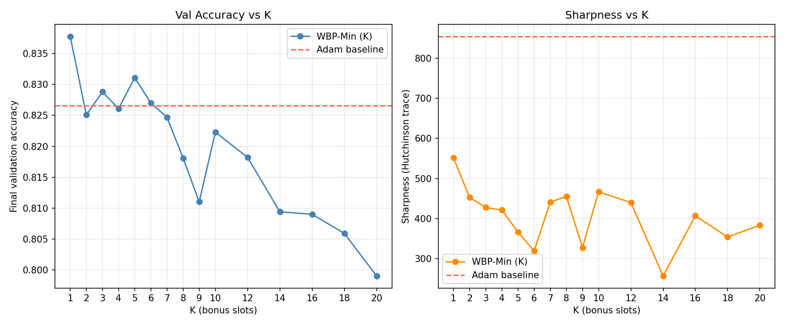

# Methodology and Results

## 1. Algorithm Description

### Baseline: Adam

Standard `torch.optim.Adam` with default betas (0.9, 0.999) and ε=1e-8. One gradient update per parameter per step via a single forward pass, cross-entropy loss, and full backward pass.

### Novel: Weighted Backpropagation (WBP)

The atomic unit of allocation is one leaf module as returned by `model.named_modules()` (modules with no children). For each outer training step:

1. Register forward hooks on all leaf modules to cache their input and output activations (detached clones). Run a full forward pass, compute loss, run full backward pass. Record the mean gradient L2-norm across each module's parameters.
2. Compute a softmax probability distribution over modules from their gradient norms with temperature τ = 1.0.
3. Sample B = 2 × n_layers slots via `torch.multinomial` with replacement, giving each module an integer slot count (may be zero).
4. For each module with ≥1 slot, in reverse index order (output → input): for each slot, zero all gradients; run the full model forward while bypassing modules 0..i-1 via forward hooks that return their cached (detached) outputs — this causes the computation graph to start at module i, so backward does not propagate past it; compute loss; call `backward()`; call `optimizer.step()` for module i only; recompute and cache module i's output using its updated weights on the cached input activation.

Modules with no parameters (ReLU, MaxPool, etc.) have no associated optimizer; if sampled they consume slots without performing an update.

## 2. Hyperparameters and Setup

| Parameter | Value |
|---|---|
| Learning rate | 0.001 |
| Adam betas | (0.9, 0.999) |
| Adam ε | 1e-8 |
| Batch size | 128 |
| Epochs | 30 |
| WBP temperature τ | 1.0 |
| WBP budget B | 2 × 52 = 104 |
| Leaf modules (n_layers) | 52 |
| Random seed | 42 |
| Device | mps |
| PyTorch | 2.8.0 |
| torchvision | 0.23.0 |
| Python | 3.9.6 |
| CIFAR-10 train augmentation | RandomHorizontalFlip, RandomCrop(32, padding=4) |
| CIFAR-10 normalization mean | (0.4914, 0.4822, 0.4465) |
| CIFAR-10 normalization std | (0.2023, 0.1994, 0.201) |

## 3. Instrumentation Methodology

- **Training loss**: mean `CrossEntropyLoss` over all batches per epoch.
- **Validation accuracy**: fraction of correct predictions on the 10k CIFAR-10 test set (model in eval mode, `torch.no_grad()`).
- **Wall-clock time**: cumulative seconds via `time.time()` measured from the start of training (data loading and model construction excluded).
- **FLOPs**: `fvcore.nn.FlopCountAnalysis` with a single (1, 3, 32, 32) input for one forward pass. Baseline: 2× forward FLOPs per step (forward + backward approximation). WBP outer step: 2× forward FLOPs; each slot at layer index i: 2 × (n_layers − i) / n_layers × forward FLOPs.
- **Gradient norm per layer**: after `backward()` in the outer step, mean L2 norm across all parameter tensors of the leaf module.
- **Allocation count**: Adam = 1.0 (constant); WBP = mean sampled slots per step over the epoch.
- **Parameter norm**: mean L2 norm across each leaf module's parameter tensors at epoch end.
- **Sharpness**: Hutchinson trace estimator — 10 Rademacher vectors, 256 validation samples; for each vector v, compute Hv = ∇(∇L·v) via `create_graph=True` double backward; trace estimate = v^T Hv; final estimate = mean over 10 vectors. MaxPool2d is temporarily replaced with AvgPool2d (same kernel/stride/padding) for this computation because MaxPool2d does not support second-order gradients.

## 4. Results Tables

### Training Loss

| Epoch | Adam | WBP |
|---|---|---|
| 1 | 1.5571 | 1.8180 |
| 2 | 1.1914 | 1.5350 |
| 3 | 1.0249 | 1.3965 |
| 4 | 0.9241 | 1.2951 |
| 5 | 0.8443 | 1.2404 |
| 6 | 0.7827 | 1.1867 |
| 7 | 0.7372 | 1.1475 |
| 8 | 0.6984 | 1.1117 |
| 9 | 0.6615 | 1.0825 |
| 10 | 0.6332 | 1.0574 |
| 11 | 0.6103 | 1.0225 |
| 12 | 0.5840 | 1.0042 |
| 13 | 0.5586 | 0.9871 |
| 14 | 0.5465 | 0.9702 |
| 15 | 0.5252 | 0.9618 |
| 16 | 0.5062 | 0.9479 |
| 17 | 0.4965 | 0.9473 |
| 18 | 0.4751 | 0.9315 |
| 19 | 0.4627 | 0.9202 |
| 20 | 0.4517 | 0.9033 |
| 21 | 0.4380 | 0.8963 |
| 22 | 0.4228 | 0.8808 |
| 23 | 0.4153 | 0.8787 |
| 24 | 0.4004 | 0.8601 |
| 25 | 0.3918 | 0.8571 |
| 26 | 0.3844 | 0.8487 |
| 27 | 0.3727 | 0.8374 |
| 28 | 0.3600 | 0.8283 |
| 29 | 0.3529 | 0.8312 |
| 30 | 0.3482 | 0.8216 |

### Validation Accuracy

| Epoch | Adam | WBP |
|---|---|---|
| 1 | 0.5219 | 0.4700 |
| 2 | 0.6277 | 0.5048 |
| 3 | 0.6744 | 0.4571 |
| 4 | 0.6909 | 0.5230 |
| 5 | 0.7000 | 0.5263 |
| 6 | 0.7295 | 0.6065 |
| 7 | 0.7496 | 0.6136 |
| 8 | 0.7597 | 0.6285 |
| 9 | 0.7713 | 0.6490 |
| 10 | 0.7731 | 0.6555 |
| 11 | 0.7741 | 0.6591 |
| 12 | 0.7929 | 0.6391 |
| 13 | 0.7781 | 0.6601 |
| 14 | 0.7909 | 0.6609 |
| 15 | 0.7942 | 0.6781 |
| 16 | 0.8001 | 0.6248 |
| 17 | 0.7905 | 0.6627 |
| 18 | 0.8158 | 0.6730 |
| 19 | 0.8095 | 0.6699 |
| 20 | 0.8192 | 0.6899 |
| 21 | 0.8127 | 0.6924 |
| 22 | 0.8302 | 0.6881 |
| 23 | 0.8236 | 0.6876 |
| 24 | 0.8269 | 0.6864 |
| 25 | 0.8221 | 0.6689 |
| 26 | 0.8254 | 0.7042 |
| 27 | 0.8183 | 0.6974 |
| 28 | 0.8270 | 0.6998 |
| 29 | 0.8341 | 0.7122 |
| 30 | 0.8266 | 0.7031 |

### Cumulative FLOPs

| Epoch | Adam | WBP |
|---|---|---|
| 1 | 2.903e+10 | 1.950e+12 |
| 2 | 5.805e+10 | 3.501e+12 |
| 3 | 8.708e+10 | 4.989e+12 |
| 4 | 1.161e+11 | 6.467e+12 |
| 5 | 1.451e+11 | 7.947e+12 |
| 6 | 1.742e+11 | 9.408e+12 |
| 7 | 2.032e+11 | 1.086e+13 |
| 8 | 2.322e+11 | 1.231e+13 |
| 9 | 2.612e+11 | 1.378e+13 |
| 10 | 2.903e+11 | 1.524e+13 |
| 11 | 3.193e+11 | 1.672e+13 |
| 12 | 3.483e+11 | 1.819e+13 |
| 13 | 3.773e+11 | 1.967e+13 |
| 14 | 4.064e+11 | 2.115e+13 |
| 15 | 4.354e+11 | 2.262e+13 |
| 16 | 4.644e+11 | 2.410e+13 |
| 17 | 4.935e+11 | 2.557e+13 |
| 18 | 5.225e+11 | 2.704e+13 |
| 19 | 5.515e+11 | 2.852e+13 |
| 20 | 5.805e+11 | 3.002e+13 |
| 21 | 6.096e+11 | 3.150e+13 |
| 22 | 6.386e+11 | 3.299e+13 |
| 23 | 6.676e+11 | 3.448e+13 |
| 24 | 6.966e+11 | 3.598e+13 |
| 25 | 7.257e+11 | 3.747e+13 |
| 26 | 7.547e+11 | 3.895e+13 |
| 27 | 7.837e+11 | 4.044e+13 |
| 28 | 8.127e+11 | 4.193e+13 |
| 29 | 8.418e+11 | 4.342e+13 |
| 30 | 8.708e+11 | 4.490e+13 |

### Loss Surface Sharpness (Hutchinson Trace)

| Method | Trace Estimate |
|---|---|
| Adam | 854.4952 |
| WBP  | 3206.2003 |

## 5. Layer-wise Allocation Heatmap (WBP mean slots/step)

| Layer | E1 | E2 | E3 | E4 | E5 | E6 | E7 | E8 | E9 | E10 | E11 | E12 | E13 | E14 | E15 | E16 | E17 | E18 | E19 | E20 | E21 | E22 | E23 | E24 | E25 | E26 | E27 | E28 | E29 | E30 |
|---|---|---|---|---|---|---|---|---|---|---|---|---|---|---|---|---|---|---|---|---|---|---|---|---|---|---|---|---|---|---|
| conv1 | 25.42 | 3.70 | 3.36 | 3.29 | 3.41 | 3.02 | 3.00 | 2.81 | 3.01 | 3.02 | 2.77 | 2.84 | 2.88 | 2.79 | 2.73 | 2.84 | 2.66 | 2.62 | 2.63 | 2.61 | 2.64 | 2.54 | 2.42 | 2.52 | 2.49 | 2.55 | 2.46 | 2.46 | 2.71 | 2.41 |
| bn1 | 0.72 | 1.11 | 1.10 | 1.20 | 1.21 | 1.23 | 1.13 | 1.21 | 1.18 | 1.27 | 1.28 | 1.21 | 1.23 | 1.29 | 1.27 | 1.24 | 1.28 | 1.17 | 1.21 | 1.36 | 1.24 | 1.30 | 1.32 | 1.34 | 1.24 | 1.19 | 1.21 | 1.31 | 1.18 | 1.31 |
| relu | 0.69 | 0.99 | 1.08 | 1.16 | 1.14 | 1.21 | 1.15 | 1.10 | 1.17 | 1.13 | 1.25 | 1.15 | 1.18 | 1.31 | 1.20 | 1.16 | 1.26 | 1.20 | 1.20 | 1.33 | 1.33 | 1.18 | 1.27 | 1.35 | 1.28 | 1.24 | 1.29 | 1.27 | 1.27 | 1.35 |
| maxpool | 0.62 | 1.02 | 1.02 | 1.07 | 1.09 | 1.05 | 1.11 | 1.12 | 1.16 | 1.28 | 1.20 | 1.25 | 1.27 | 1.30 | 1.20 | 1.23 | 1.24 | 1.19 | 1.22 | 1.31 | 1.25 | 1.34 | 1.31 | 1.24 | 1.18 | 1.17 | 1.29 | 1.29 | 1.26 | 1.24 |
| layer1.0.conv1 | 3.59 | 2.32 | 1.97 | 1.85 | 1.67 | 1.61 | 1.64 | 1.57 | 1.65 | 1.49 | 1.56 | 1.54 | 1.46 | 1.50 | 1.46 | 1.32 | 1.40 | 1.55 | 1.37 | 1.53 | 1.42 | 1.32 | 1.48 | 1.42 | 1.40 | 1.40 | 1.46 | 1.41 | 1.40 | 1.27 |
| layer1.0.bn1 | 0.73 | 1.13 | 1.05 | 1.19 | 1.08 | 1.24 | 1.21 | 1.21 | 1.23 | 1.25 | 1.26 | 1.19 | 1.27 | 1.09 | 1.30 | 1.26 | 1.17 | 1.30 | 1.26 | 1.17 | 1.30 | 1.25 | 1.23 | 1.40 | 1.25 | 1.26 | 1.29 | 1.38 | 1.18 | 1.29 |
| layer1.0.relu | 0.65 | 0.96 | 1.12 | 1.06 | 1.10 | 1.03 | 1.15 | 1.21 | 1.08 | 1.16 | 1.18 | 1.21 | 1.23 | 1.23 | 1.17 | 1.25 | 1.24 | 1.28 | 1.16 | 1.25 | 1.25 | 1.23 | 1.27 | 1.25 | 1.26 | 1.25 | 1.21 | 1.21 | 1.23 | 1.24 |
| layer1.0.conv2 | 6.03 | 6.55 | 4.73 | 3.88 | 3.56 | 2.92 | 2.73 | 2.58 | 2.55 | 2.37 | 2.30 | 2.29 | 2.25 | 2.17 | 2.17 | 2.10 | 2.21 | 2.20 | 2.07 | 2.14 | 2.03 | 2.14 | 1.98 | 2.06 | 1.91 | 2.01 | 1.90 | 1.98 | 1.94 | 1.87 |
| layer1.0.bn2 | 0.73 | 1.13 | 1.14 | 1.15 | 1.23 | 1.15 | 1.20 | 1.28 | 1.27 | 1.17 | 1.19 | 1.25 | 1.30 | 1.28 | 1.24 | 1.25 | 1.18 | 1.27 | 1.16 | 1.32 | 1.20 | 1.34 | 1.40 | 1.31 | 1.36 | 1.24 | 1.21 | 1.25 | 1.20 | 1.17 |
| layer1.1.conv1 | 2.48 | 2.27 | 1.98 | 1.77 | 1.74 | 1.66 | 1.65 | 1.59 | 1.70 | 1.52 | 1.52 | 1.58 | 1.55 | 1.47 | 1.41 | 1.39 | 1.47 | 1.48 | 1.60 | 1.44 | 1.46 | 1.44 | 1.46 | 1.49 | 1.31 | 1.47 | 1.43 | 1.32 | 1.50 | 1.38 |
| layer1.1.bn1 | 0.71 | 1.07 | 1.14 | 1.27 | 1.17 | 1.31 | 1.16 | 1.24 | 1.18 | 1.29 | 1.31 | 1.23 | 1.20 | 1.19 | 1.19 | 1.29 | 1.17 | 1.24 | 1.20 | 1.30 | 1.34 | 1.26 | 1.31 | 1.23 | 1.31 | 1.19 | 1.32 | 1.18 | 1.26 | 1.37 |
| layer1.1.relu | 0.63 | 1.03 | 1.18 | 1.12 | 1.14 | 1.11 | 1.11 | 1.16 | 1.19 | 1.15 | 1.28 | 1.17 | 1.27 | 1.13 | 1.25 | 1.18 | 1.10 | 1.20 | 1.27 | 1.34 | 1.33 | 1.28 | 1.21 | 1.33 | 1.27 | 1.28 | 1.22 | 1.16 | 1.21 | 1.27 |
| layer1.1.conv2 | 3.38 | 4.02 | 3.61 | 3.32 | 3.15 | 2.91 | 2.68 | 2.41 | 2.36 | 2.23 | 2.22 | 2.20 | 2.27 | 2.12 | 2.29 | 2.25 | 2.04 | 2.17 | 2.05 | 1.99 | 2.17 | 1.96 | 2.03 | 2.01 | 1.82 | 1.99 | 1.99 | 1.91 | 2.02 | 1.93 |
| layer1.1.bn2 | 0.70 | 1.02 | 1.11 | 1.13 | 1.25 | 1.18 | 1.14 | 1.23 | 1.23 | 1.21 | 1.36 | 1.27 | 1.30 | 1.31 | 1.14 | 1.31 | 1.14 | 1.17 | 1.29 | 1.26 | 1.35 | 1.35 | 1.30 | 1.27 | 1.22 | 1.14 | 1.19 | 1.27 | 1.17 | 1.23 |
| layer2.0.conv1 | 2.78 | 2.39 | 2.04 | 1.92 | 1.94 | 1.89 | 1.94 | 1.89 | 1.74 | 1.85 | 2.01 | 1.90 | 1.75 | 1.98 | 1.97 | 1.93 | 1.70 | 1.84 | 1.89 | 1.81 | 1.85 | 1.84 | 1.71 | 1.84 | 1.75 | 1.79 | 1.77 | 2.04 | 1.82 | 1.82 |
| layer2.0.bn1 | 0.69 | 1.03 | 1.08 | 1.23 | 1.21 | 1.19 | 1.27 | 1.14 | 1.19 | 1.30 | 1.29 | 1.29 | 1.21 | 1.27 | 1.17 | 1.22 | 1.28 | 1.23 | 1.17 | 1.27 | 1.17 | 1.24 | 1.26 | 1.33 | 1.20 | 1.31 | 1.24 | 1.32 | 1.20 | 1.31 |
| layer2.0.relu | 0.66 | 0.93 | 0.97 | 1.08 | 1.13 | 1.07 | 1.13 | 1.18 | 1.17 | 1.22 | 1.22 | 1.20 | 1.21 | 1.08 | 1.34 | 1.26 | 1.19 | 1.20 | 1.34 | 1.27 | 1.26 | 1.27 | 1.28 | 1.21 | 1.22 | 1.41 | 1.21 | 1.09 | 1.22 | 1.19 |
| layer2.0.conv2 | 4.98 | 5.92 | 6.01 | 6.09 | 6.38 | 6.34 | 6.64 | 6.97 | 6.89 | 7.32 | 7.32 | 7.58 | 7.75 | 8.02 | 7.81 | 8.12 | 8.28 | 8.10 | 8.02 | 8.28 | 8.30 | 8.24 | 8.34 | 8.44 | 8.97 | 8.73 | 8.67 | 9.06 | 8.77 | 9.06 |
| layer2.0.bn2 | 0.65 | 0.99 | 1.04 | 1.24 | 1.05 | 1.27 | 1.22 | 1.21 | 1.31 | 1.29 | 1.28 | 1.24 | 1.35 | 1.27 | 1.30 | 1.31 | 1.22 | 1.21 | 1.34 | 1.36 | 1.37 | 1.41 | 1.34 | 1.37 | 1.29 | 1.39 | 1.34 | 1.37 | 1.21 | 1.30 |
| layer2.0.downsample.0 | 1.28 | 1.60 | 1.81 | 1.93 | 1.96 | 2.14 | 2.02 | 2.17 | 2.31 | 2.25 | 2.24 | 2.26 | 2.35 | 2.46 | 2.43 | 2.50 | 2.40 | 2.31 | 2.47 | 2.40 | 2.34 | 2.52 | 2.56 | 2.43 | 2.46 | 2.32 | 2.43 | 2.39 | 2.41 | 2.52 |
| layer2.0.downsample.1 | 0.65 | 1.15 | 1.19 | 1.12 | 1.30 | 1.21 | 1.16 | 1.14 | 1.39 | 1.20 | 1.46 | 1.29 | 1.38 | 1.27 | 1.36 | 1.28 | 1.34 | 1.35 | 1.38 | 1.33 | 1.27 | 1.39 | 1.39 | 1.31 | 1.40 | 1.34 | 1.37 | 1.37 | 1.31 | 1.34 |
| layer2.1.conv1 | 2.36 | 2.17 | 1.86 | 1.93 | 1.92 | 1.87 | 1.73 | 1.78 | 1.82 | 1.70 | 1.79 | 1.70 | 1.66 | 1.72 | 1.73 | 1.74 | 1.72 | 1.60 | 1.69 | 1.60 | 1.61 | 1.53 | 1.71 | 1.78 | 1.63 | 1.63 | 1.62 | 1.68 | 1.63 | 1.58 |
| layer2.1.bn1 | 0.76 | 1.10 | 1.00 | 1.13 | 1.10 | 1.20 | 1.31 | 1.16 | 1.27 | 1.18 | 1.27 | 1.26 | 1.21 | 1.18 | 1.25 | 1.20 | 1.20 | 1.20 | 1.27 | 1.29 | 1.26 | 1.28 | 1.37 | 1.21 | 1.22 | 1.27 | 1.35 | 1.19 | 1.16 | 1.16 |
| layer2.1.relu | 0.63 | 0.95 | 1.07 | 1.09 | 1.10 | 1.13 | 1.16 | 1.20 | 1.24 | 1.19 | 1.10 | 1.28 | 1.22 | 1.20 | 1.19 | 1.20 | 1.19 | 1.15 | 1.33 | 1.32 | 1.23 | 1.29 | 1.35 | 1.30 | 1.36 | 1.28 | 1.30 | 1.24 | 1.20 | 1.17 |
| layer2.1.conv2 | 3.34 | 4.17 | 4.07 | 4.06 | 4.45 | 4.51 | 4.52 | 4.74 | 4.69 | 4.88 | 4.73 | 4.68 | 5.07 | 4.85 | 4.72 | 4.99 | 5.08 | 5.35 | 5.08 | 4.97 | 5.26 | 5.32 | 5.05 | 5.15 | 5.04 | 5.29 | 5.34 | 5.23 | 5.05 | 5.41 |
| layer2.1.bn2 | 0.71 | 0.99 | 1.08 | 1.08 | 1.14 | 1.25 | 1.26 | 1.29 | 1.31 | 1.26 | 1.31 | 1.31 | 1.26 | 1.38 | 1.27 | 1.23 | 1.26 | 1.21 | 1.41 | 1.37 | 1.28 | 1.41 | 1.20 | 1.28 | 1.28 | 1.35 | 1.31 | 1.27 | 1.41 | 1.23 |
| layer3.0.conv1 | 2.14 | 2.12 | 1.83 | 1.77 | 1.75 | 1.64 | 1.64 | 1.65 | 1.68 | 1.61 | 1.59 | 1.73 | 1.60 | 1.62 | 1.55 | 1.66 | 1.56 | 1.62 | 1.57 | 1.71 | 1.64 | 1.51 | 1.53 | 1.61 | 1.46 | 1.51 | 1.56 | 1.59 | 1.48 | 1.51 |
| layer3.0.bn1 | 0.73 | 1.16 | 1.08 | 1.13 | 1.18 | 1.18 | 1.19 | 1.14 | 1.19 | 1.17 | 1.19 | 1.19 | 1.23 | 1.26 | 1.30 | 1.17 | 1.23 | 1.19 | 1.27 | 1.28 | 1.29 | 1.23 | 1.20 | 1.33 | 1.23 | 1.29 | 1.25 | 1.23 | 1.35 | 1.21 |
| layer3.0.relu | 0.66 | 1.04 | 1.05 | 1.05 | 1.12 | 1.13 | 1.15 | 1.11 | 1.15 | 1.23 | 1.21 | 1.17 | 1.21 | 1.21 | 1.38 | 1.16 | 1.24 | 1.22 | 1.22 | 1.22 | 1.30 | 1.26 | 1.21 | 1.24 | 1.26 | 1.16 | 1.19 | 1.32 | 1.26 | 1.25 |
| layer3.0.conv2 | 4.82 | 5.71 | 5.73 | 5.49 | 5.52 | 5.63 | 5.64 | 5.69 | 5.46 | 5.81 | 5.77 | 5.83 | 5.52 | 5.61 | 5.76 | 5.86 | 5.84 | 5.98 | 5.75 | 5.83 | 5.79 | 5.80 | 5.87 | 5.92 | 6.26 | 5.96 | 6.35 | 6.07 | 6.18 | 6.26 |
| layer3.0.bn2 | 0.69 | 1.07 | 1.10 | 1.04 | 1.21 | 1.09 | 1.22 | 1.20 | 1.22 | 1.29 | 1.15 | 1.26 | 1.24 | 1.29 | 1.25 | 1.41 | 1.20 | 1.27 | 1.28 | 1.24 | 1.31 | 1.39 | 1.29 | 1.24 | 1.33 | 1.35 | 1.28 | 1.35 | 1.27 | 1.26 |
| layer3.0.downsample.0 | 1.21 | 1.66 | 1.80 | 1.88 | 1.85 | 1.86 | 1.88 | 1.94 | 1.83 | 1.93 | 1.92 | 2.03 | 2.04 | 1.98 | 1.97 | 2.06 | 1.91 | 1.96 | 2.18 | 2.20 | 1.98 | 1.98 | 2.06 | 2.15 | 2.13 | 2.12 | 1.97 | 2.04 | 2.11 | 2.03 |
| layer3.0.downsample.1 | 0.66 | 1.05 | 1.10 | 1.13 | 1.13 | 1.29 | 1.18 | 1.15 | 1.19 | 1.15 | 1.29 | 1.29 | 1.26 | 1.34 | 1.33 | 1.23 | 1.28 | 1.26 | 1.34 | 1.27 | 1.25 | 1.28 | 1.28 | 1.32 | 1.31 | 1.30 | 1.27 | 1.25 | 1.36 | 1.22 |
| layer3.1.conv1 | 1.66 | 1.55 | 1.56 | 1.46 | 1.53 | 1.52 | 1.34 | 1.44 | 1.48 | 1.55 | 1.51 | 1.41 | 1.37 | 1.41 | 1.49 | 1.46 | 1.43 | 1.33 | 1.52 | 1.52 | 1.38 | 1.50 | 1.38 | 1.46 | 1.47 | 1.42 | 1.41 | 1.56 | 1.43 | 1.47 |
| layer3.1.bn1 | 0.65 | 1.04 | 1.05 | 1.17 | 1.03 | 1.17 | 1.24 | 1.06 | 1.19 | 1.20 | 1.29 | 1.19 | 1.23 | 1.15 | 1.28 | 1.22 | 1.25 | 1.31 | 1.23 | 1.22 | 1.18 | 1.25 | 1.36 | 1.18 | 1.17 | 1.26 | 1.31 | 1.18 | 1.27 | 1.19 |
| layer3.1.relu | 0.68 | 0.94 | 1.06 | 1.14 | 1.07 | 1.13 | 1.14 | 1.08 | 1.26 | 1.19 | 1.23 | 1.33 | 1.39 | 1.14 | 1.25 | 1.21 | 1.13 | 1.27 | 1.20 | 1.23 | 1.26 | 1.23 | 1.30 | 1.28 | 1.31 | 1.09 | 1.29 | 1.14 | 1.15 | 1.25 |
| layer3.1.conv2 | 3.19 | 4.15 | 4.33 | 4.55 | 4.36 | 4.75 | 4.59 | 4.51 | 4.84 | 4.51 | 4.74 | 4.57 | 4.66 | 4.45 | 4.28 | 4.55 | 4.54 | 4.57 | 4.41 | 4.62 | 4.58 | 4.51 | 4.54 | 4.56 | 4.69 | 4.62 | 4.44 | 4.68 | 4.80 | 4.69 |
| layer3.1.bn2 | 0.64 | 0.94 | 1.13 | 1.18 | 1.26 | 1.29 | 1.22 | 1.13 | 1.20 | 1.14 | 1.23 | 1.21 | 1.24 | 1.33 | 1.19 | 1.29 | 1.23 | 1.20 | 1.21 | 1.28 | 1.21 | 1.36 | 1.36 | 1.28 | 1.25 | 1.32 | 1.40 | 1.31 | 1.19 | 1.24 |
| layer4.0.conv1 | 1.81 | 1.80 | 1.66 | 1.57 | 1.43 | 1.47 | 1.42 | 1.52 | 1.42 | 1.40 | 1.49 | 1.46 | 1.53 | 1.47 | 1.49 | 1.41 | 1.46 | 1.59 | 1.48 | 1.36 | 1.45 | 1.40 | 1.51 | 1.48 | 1.42 | 1.46 | 1.45 | 1.52 | 1.40 | 1.41 |
| layer4.0.bn1 | 0.65 | 1.05 | 0.99 | 1.04 | 1.13 | 1.17 | 1.10 | 1.20 | 1.17 | 1.20 | 1.32 | 1.21 | 1.34 | 1.29 | 1.33 | 1.26 | 1.23 | 1.26 | 1.29 | 1.35 | 1.19 | 1.36 | 1.29 | 1.27 | 1.14 | 1.20 | 1.16 | 1.25 | 1.26 | 1.22 |
| layer4.0.relu | 0.64 | 1.00 | 1.09 | 1.06 | 1.07 | 1.18 | 1.11 | 1.10 | 1.26 | 1.16 | 1.17 | 1.19 | 1.25 | 1.26 | 1.25 | 1.23 | 1.17 | 1.22 | 1.25 | 1.28 | 1.33 | 1.35 | 1.31 | 1.33 | 1.21 | 1.22 | 1.25 | 1.14 | 1.23 | 1.36 |
| layer4.0.conv2 | 3.66 | 6.20 | 7.05 | 7.40 | 7.64 | 7.83 | 7.76 | 7.49 | 7.30 | 7.45 | 7.08 | 7.07 | 7.07 | 7.27 | 7.33 | 7.07 | 7.58 | 7.43 | 7.32 | 6.93 | 7.05 | 6.86 | 6.99 | 6.81 | 7.57 | 7.57 | 7.47 | 7.41 | 7.57 | 7.53 |
| layer4.0.bn2 | 0.66 | 1.14 | 1.10 | 1.22 | 1.16 | 1.17 | 1.26 | 1.19 | 1.20 | 1.22 | 1.23 | 1.30 | 1.22 | 1.24 | 1.28 | 1.32 | 1.26 | 1.25 | 1.27 | 1.28 | 1.39 | 1.35 | 1.29 | 1.35 | 1.33 | 1.21 | 1.28 | 1.34 | 1.37 | 1.29 |
| layer4.0.downsample.0 | 1.17 | 1.87 | 2.00 | 2.12 | 2.09 | 2.23 | 2.25 | 2.30 | 2.32 | 2.32 | 2.39 | 2.34 | 2.28 | 2.43 | 2.42 | 2.30 | 2.33 | 2.31 | 2.33 | 2.32 | 2.52 | 2.53 | 2.54 | 2.47 | 2.49 | 2.43 | 2.46 | 2.36 | 2.42 | 2.56 |
| layer4.0.downsample.1 | 0.70 | 0.96 | 1.08 | 1.15 | 1.20 | 1.17 | 1.21 | 1.28 | 1.24 | 1.19 | 1.28 | 1.36 | 1.34 | 1.31 | 1.34 | 1.36 | 1.38 | 1.38 | 1.34 | 1.23 | 1.31 | 1.40 | 1.29 | 1.42 | 1.25 | 1.23 | 1.35 | 1.31 | 1.34 | 1.32 |
| layer4.1.conv1 | 1.47 | 1.77 | 1.57 | 1.61 | 1.28 | 1.35 | 1.43 | 1.42 | 1.36 | 1.45 | 1.45 | 1.50 | 1.21 | 1.51 | 1.39 | 1.30 | 1.36 | 1.38 | 1.44 | 1.48 | 1.31 | 1.35 | 1.44 | 1.25 | 1.25 | 1.34 | 1.29 | 1.29 | 1.31 | 1.38 |
| layer4.1.bn1 | 0.64 | 0.96 | 1.05 | 1.06 | 1.16 | 1.09 | 1.22 | 1.11 | 1.18 | 1.31 | 1.26 | 1.25 | 1.19 | 1.23 | 1.23 | 1.15 | 1.26 | 1.25 | 1.23 | 1.22 | 1.35 | 1.25 | 1.20 | 1.27 | 1.21 | 1.31 | 1.21 | 1.25 | 1.18 | 1.18 |
| layer4.1.relu | 0.67 | 1.03 | 1.01 | 1.13 | 1.12 | 1.15 | 1.15 | 1.21 | 1.18 | 1.27 | 1.16 | 1.17 | 1.23 | 1.20 | 1.25 | 1.26 | 1.17 | 1.23 | 1.20 | 1.16 | 1.35 | 1.15 | 1.26 | 1.31 | 1.23 | 1.19 | 1.24 | 1.26 | 1.37 | 1.19 |
| layer4.1.conv2 | 3.02 | 5.82 | 7.44 | 7.36 | 7.37 | 7.24 | 7.76 | 7.95 | 6.94 | 6.56 | 6.12 | 6.20 | 6.11 | 5.94 | 5.97 | 5.92 | 6.42 | 5.40 | 5.49 | 5.19 | 4.93 | 4.83 | 4.87 | 4.55 | 4.92 | 4.96 | 4.89 | 4.74 | 4.88 | 4.80 |
| layer4.1.bn2 | 0.69 | 0.95 | 1.18 | 1.16 | 1.16 | 1.09 | 1.20 | 1.27 | 1.29 | 1.21 | 1.25 | 1.25 | 1.21 | 1.27 | 1.35 | 1.27 | 1.23 | 1.27 | 1.26 | 1.25 | 1.33 | 1.39 | 1.27 | 1.37 | 1.27 | 1.41 | 1.21 | 1.34 | 1.27 | 1.21 |
| avgpool | 0.67 | 0.88 | 1.04 | 1.15 | 1.11 | 1.14 | 1.08 | 1.09 | 1.15 | 1.27 | 1.21 | 1.27 | 1.16 | 1.27 | 1.25 | 1.22 | 1.20 | 1.24 | 1.27 | 1.19 | 1.27 | 1.30 | 1.26 | 1.34 | 1.18 | 1.17 | 1.23 | 1.20 | 1.17 | 1.17 |
| fc | 3.23 | 4.43 | 4.08 | 3.62 | 3.44 | 3.36 | 3.19 | 3.18 | 3.00 | 3.02 | 2.76 | 2.84 | 2.83 | 2.68 | 2.53 | 2.60 | 2.68 | 2.81 | 2.57 | 2.52 | 2.54 | 2.51 | 2.52 | 2.33 | 2.53 | 2.40 | 2.37 | 2.24 | 2.45 | 2.36 |

## 6. Training Log

### Adam

| Epoch | Train Loss | Val Acc | Time (s) | Cumul. FLOPs |
|---|---|---|---|---|
| 1 | 1.5571 | 0.5219 | 41.6 | 2.903e+10 |
| 2 | 1.1914 | 0.6277 | 81.3 | 5.805e+10 |
| 3 | 1.0249 | 0.6744 | 121.1 | 8.708e+10 |
| 4 | 0.9241 | 0.6909 | 160.9 | 1.161e+11 |
| 5 | 0.8443 | 0.7000 | 200.7 | 1.451e+11 |
| 6 | 0.7827 | 0.7295 | 240.6 | 1.742e+11 |
| 7 | 0.7372 | 0.7496 | 280.3 | 2.032e+11 |
| 8 | 0.6984 | 0.7597 | 320.0 | 2.322e+11 |
| 9 | 0.6615 | 0.7713 | 360.1 | 2.612e+11 |
| 10 | 0.6332 | 0.7731 | 400.4 | 2.903e+11 |
| 11 | 0.6103 | 0.7741 | 441.0 | 3.193e+11 |
| 12 | 0.5840 | 0.7929 | 481.2 | 3.483e+11 |
| 13 | 0.5586 | 0.7781 | 521.5 | 3.773e+11 |
| 14 | 0.5465 | 0.7909 | 561.9 | 4.064e+11 |
| 15 | 0.5252 | 0.7942 | 602.0 | 4.354e+11 |
| 16 | 0.5062 | 0.8001 | 642.3 | 4.644e+11 |
| 17 | 0.4965 | 0.7905 | 682.6 | 4.935e+11 |
| 18 | 0.4751 | 0.8158 | 722.6 | 5.225e+11 |
| 19 | 0.4627 | 0.8095 | 762.6 | 5.515e+11 |
| 20 | 0.4517 | 0.8192 | 803.0 | 5.805e+11 |
| 21 | 0.4380 | 0.8127 | 843.4 | 6.096e+11 |
| 22 | 0.4228 | 0.8302 | 883.2 | 6.386e+11 |
| 23 | 0.4153 | 0.8236 | 923.3 | 6.676e+11 |
| 24 | 0.4004 | 0.8269 | 963.2 | 6.966e+11 |
| 25 | 0.3918 | 0.8221 | 1003.1 | 7.257e+11 |
| 26 | 0.3844 | 0.8254 | 1043.3 | 7.547e+11 |
| 27 | 0.3727 | 0.8183 | 1083.5 | 7.837e+11 |
| 28 | 0.3600 | 0.8270 | 1123.7 | 8.127e+11 |
| 29 | 0.3529 | 0.8341 | 1163.9 | 8.418e+11 |
| 30 | 0.3482 | 0.8266 | 1204.0 | 8.708e+11 |

### WBP

| Epoch | Train Loss | Val Acc | Time (s) | Cumul. FLOPs | Partial Passes |
|---|---|---|---|---|---|
| 1 | 1.8180 | 0.4700 | 386.0 | 1.950e+12 | 40664 |
| 2 | 1.5350 | 0.5048 | 750.2 | 3.501e+12 | 40664 |
| 3 | 1.3965 | 0.4571 | 1128.3 | 4.989e+12 | 40664 |
| 4 | 1.2951 | 0.5230 | 1509.5 | 6.467e+12 | 40664 |
| 5 | 1.2404 | 0.5263 | 1891.6 | 7.947e+12 | 40664 |
| 6 | 1.1867 | 0.6065 | 2269.5 | 9.408e+12 | 40664 |
| 7 | 1.1475 | 0.6136 | 2649.3 | 1.086e+13 | 40664 |
| 8 | 1.1117 | 0.6285 | 3030.3 | 1.231e+13 | 40664 |
| 9 | 1.0825 | 0.6490 | 3414.2 | 1.378e+13 | 40664 |
| 10 | 1.0574 | 0.6555 | 3790.2 | 1.524e+13 | 40664 |
| 11 | 1.0225 | 0.6591 | 4175.4 | 1.672e+13 | 40664 |
| 12 | 1.0042 | 0.6391 | 4561.1 | 1.819e+13 | 40664 |
| 13 | 0.9871 | 0.6601 | 4947.3 | 1.967e+13 | 40664 |
| 14 | 0.9702 | 0.6609 | 5335.1 | 2.115e+13 | 40664 |
| 15 | 0.9618 | 0.6781 | 5723.3 | 2.262e+13 | 40664 |
| 16 | 0.9479 | 0.6248 | 6113.4 | 2.410e+13 | 40664 |
| 17 | 0.9473 | 0.6627 | 6501.0 | 2.557e+13 | 40664 |
| 18 | 0.9315 | 0.6730 | 6893.7 | 2.704e+13 | 40664 |
| 19 | 0.9202 | 0.6699 | 7283.8 | 2.852e+13 | 40664 |
| 20 | 0.9033 | 0.6899 | 7674.2 | 3.002e+13 | 40664 |
| 21 | 0.8963 | 0.6924 | 8063.2 | 3.150e+13 | 40664 |
| 22 | 0.8808 | 0.6881 | 8451.0 | 3.299e+13 | 40664 |
| 23 | 0.8787 | 0.6876 | 8838.6 | 3.448e+13 | 40664 |
| 24 | 0.8601 | 0.6864 | 9218.7 | 3.598e+13 | 40664 |
| 25 | 0.8571 | 0.6689 | 9591.1 | 3.747e+13 | 40664 |
| 26 | 0.8487 | 0.7042 | 9962.9 | 3.895e+13 | 40664 |
| 27 | 0.8374 | 0.6974 | 10335.7 | 4.044e+13 | 40664 |
| 28 | 0.8283 | 0.6998 | 10707.9 | 4.193e+13 | 40664 |
| 29 | 0.8312 | 0.7122 | 11078.5 | 4.342e+13 | 40664 |
| 30 | 0.8216 | 0.7031 | 11449.6 | 4.490e+13 | 40664 |

## 7. Problems Encountered

None.

## 8. Conclusions

After 30 epochs, Adam achieved 0.8266 validation accuracy (final training loss 0.3482) while WBP achieved 0.7031 validation accuracy (final training loss 0.8216). WBP consumed approximately 51.6× more FLOPs than Adam due to the 104-slot budget of partial forward passes per outer step. Loss surface sharpness: Adam = 854.4952, WBP = 3206.2003.

## WBP-Minimal Results

### Algorithm Description

Each outer step:

1. Forward hooks cache all leaf-module output activations (detached clones). Full forward pass, cross-entropy loss, full backward pass. Record mean gradient L2-norm per leaf module.
2. Identify the **bonus layer**: the leaf module with the largest gradient norm.
3. **Floor update**: one Adam step over all model parameters (identical to the Adam baseline).
4. **Bonus update**: zero gradients; run the full model forward with modules 0..i-1 bypassed via forward hooks returning their cached pre-update outputs, so the computation graph starts at the bonus layer; compute loss; backward; one Adam step on the bonus layer's parameters only.

The floor optimizer is one Adam instance over all parameters. Each leaf module has its own separate Adam optimizer for bonus updates, persisted across steps so momentum accumulates correctly.

### Training Log

| Epoch | Train Loss | Val Acc | Time (s) | Cumul. FLOPs | Epoch Bonus Layer |
|---|---|---|---|---|---|
| 1 | 1.5658 | 0.5489 | 42.7 | 5.638e+10 | conv1 |
| 2 | 1.1866 | 0.6587 | 85.1 | 1.141e+11 | conv1 |
| 3 | 1.0223 | 0.6755 | 127.9 | 1.721e+11 | conv1 |
| 4 | 0.9220 | 0.7016 | 170.7 | 2.302e+11 | conv1 |
| 5 | 0.8476 | 0.7156 | 213.6 | 2.882e+11 | conv1 |
| 6 | 0.7903 | 0.7125 | 256.4 | 3.462e+11 | conv1 |
| 7 | 0.7393 | 0.7509 | 299.3 | 4.043e+11 | conv1 |
| 8 | 0.6966 | 0.7660 | 342.1 | 4.623e+11 | conv1 |
| 9 | 0.6614 | 0.7753 | 384.9 | 5.204e+11 | conv1 |
| 10 | 0.6340 | 0.7775 | 428.1 | 5.784e+11 | conv1 |
| 11 | 0.6102 | 0.7893 | 471.0 | 6.365e+11 | conv1 |
| 12 | 0.5820 | 0.7899 | 514.2 | 6.945e+11 | conv1 |
| 13 | 0.5616 | 0.7846 | 557.4 | 7.526e+11 | conv1 |
| 14 | 0.5465 | 0.7984 | 600.7 | 8.106e+11 | conv1 |
| 15 | 0.5271 | 0.8024 | 644.0 | 8.687e+11 | conv1 |
| 16 | 0.5066 | 0.8060 | 687.3 | 9.267e+11 | conv1 |
| 17 | 0.4996 | 0.8072 | 730.6 | 9.848e+11 | conv1 |
| 18 | 0.4812 | 0.7923 | 774.0 | 1.043e+12 | conv1 |
| 19 | 0.4633 | 0.8158 | 817.2 | 1.101e+12 | conv1 |
| 20 | 0.4555 | 0.8144 | 860.4 | 1.159e+12 | conv1 |
| 21 | 0.4402 | 0.8182 | 903.6 | 1.217e+12 | conv1 |
| 22 | 0.4204 | 0.8165 | 946.7 | 1.275e+12 | conv1 |
| 23 | 0.4165 | 0.8232 | 989.9 | 1.333e+12 | conv1 |
| 24 | 0.4028 | 0.8235 | 1033.2 | 1.391e+12 | conv1 |
| 25 | 0.3929 | 0.8306 | 1076.4 | 1.449e+12 | conv1 |
| 26 | 0.3846 | 0.8347 | 1119.8 | 1.507e+12 | conv1 |
| 27 | 0.3684 | 0.7968 | 1162.8 | 1.565e+12 | conv1 |
| 28 | 0.3627 | 0.8277 | 1205.9 | 1.623e+12 | conv1 |
| 29 | 0.3572 | 0.8266 | 1249.2 | 1.681e+12 | conv1 |
| 30 | 0.3467 | 0.8378 | 1292.3 | 1.739e+12 | conv1 |

**Hutchinson Hessian Trace**: 551.2936 (MaxPool2d replaced with AvgPool2d for double-backward compatibility)

### Layer-wise Mean Allocation per Epoch (floor=1 + bonus fraction)

| Layer | E1 | E2 | E3 | E4 | E5 | E6 | E7 | E8 | E9 | E10 | E11 | E12 | E13 | E14 | E15 | E16 | E17 | E18 | E19 | E20 | E21 | E22 | E23 | E24 | E25 | E26 | E27 | E28 | E29 | E30 |
|---|---|---|---|---|---|---|---|---|---|---|---|---|---|---|---|---|---|---|---|---|---|---|---|---|---|---|---|---|---|---|
| conv1 | 1.941 | 1.987 | 2.000 | 2.000 | 1.997 | 2.000 | 2.000 | 2.000 | 2.000 | 2.000 | 2.000 | 2.000 | 2.000 | 2.000 | 2.000 | 2.000 | 2.000 | 2.000 | 2.000 | 2.000 | 2.000 | 2.000 | 2.000 | 2.000 | 2.000 | 2.000 | 2.000 | 2.000 | 2.000 | 2.000 |
| bn1 | 1.000 | 1.000 | 1.000 | 1.000 | 1.000 | 1.000 | 1.000 | 1.000 | 1.000 | 1.000 | 1.000 | 1.000 | 1.000 | 1.000 | 1.000 | 1.000 | 1.000 | 1.000 | 1.000 | 1.000 | 1.000 | 1.000 | 1.000 | 1.000 | 1.000 | 1.000 | 1.000 | 1.000 | 1.000 | 1.000 |
| relu | 1.000 | 1.000 | 1.000 | 1.000 | 1.000 | 1.000 | 1.000 | 1.000 | 1.000 | 1.000 | 1.000 | 1.000 | 1.000 | 1.000 | 1.000 | 1.000 | 1.000 | 1.000 | 1.000 | 1.000 | 1.000 | 1.000 | 1.000 | 1.000 | 1.000 | 1.000 | 1.000 | 1.000 | 1.000 | 1.000 |
| maxpool | 1.000 | 1.000 | 1.000 | 1.000 | 1.000 | 1.000 | 1.000 | 1.000 | 1.000 | 1.000 | 1.000 | 1.000 | 1.000 | 1.000 | 1.000 | 1.000 | 1.000 | 1.000 | 1.000 | 1.000 | 1.000 | 1.000 | 1.000 | 1.000 | 1.000 | 1.000 | 1.000 | 1.000 | 1.000 | 1.000 |
| layer1.0.conv1 | 1.000 | 1.000 | 1.000 | 1.000 | 1.000 | 1.000 | 1.000 | 1.000 | 1.000 | 1.000 | 1.000 | 1.000 | 1.000 | 1.000 | 1.000 | 1.000 | 1.000 | 1.000 | 1.000 | 1.000 | 1.000 | 1.000 | 1.000 | 1.000 | 1.000 | 1.000 | 1.000 | 1.000 | 1.000 | 1.000 |
| layer1.0.bn1 | 1.000 | 1.000 | 1.000 | 1.000 | 1.000 | 1.000 | 1.000 | 1.000 | 1.000 | 1.000 | 1.000 | 1.000 | 1.000 | 1.000 | 1.000 | 1.000 | 1.000 | 1.000 | 1.000 | 1.000 | 1.000 | 1.000 | 1.000 | 1.000 | 1.000 | 1.000 | 1.000 | 1.000 | 1.000 | 1.000 |
| layer1.0.relu | 1.000 | 1.000 | 1.000 | 1.000 | 1.000 | 1.000 | 1.000 | 1.000 | 1.000 | 1.000 | 1.000 | 1.000 | 1.000 | 1.000 | 1.000 | 1.000 | 1.000 | 1.000 | 1.000 | 1.000 | 1.000 | 1.000 | 1.000 | 1.000 | 1.000 | 1.000 | 1.000 | 1.000 | 1.000 | 1.000 |
| layer1.0.conv2 | 1.000 | 1.000 | 1.000 | 1.000 | 1.000 | 1.000 | 1.000 | 1.000 | 1.000 | 1.000 | 1.000 | 1.000 | 1.000 | 1.000 | 1.000 | 1.000 | 1.000 | 1.000 | 1.000 | 1.000 | 1.000 | 1.000 | 1.000 | 1.000 | 1.000 | 1.000 | 1.000 | 1.000 | 1.000 | 1.000 |
| layer1.0.bn2 | 1.000 | 1.000 | 1.000 | 1.000 | 1.000 | 1.000 | 1.000 | 1.000 | 1.000 | 1.000 | 1.000 | 1.000 | 1.000 | 1.000 | 1.000 | 1.000 | 1.000 | 1.000 | 1.000 | 1.000 | 1.000 | 1.000 | 1.000 | 1.000 | 1.000 | 1.000 | 1.000 | 1.000 | 1.000 | 1.000 |
| layer1.1.conv1 | 1.000 | 1.000 | 1.000 | 1.000 | 1.000 | 1.000 | 1.000 | 1.000 | 1.000 | 1.000 | 1.000 | 1.000 | 1.000 | 1.000 | 1.000 | 1.000 | 1.000 | 1.000 | 1.000 | 1.000 | 1.000 | 1.000 | 1.000 | 1.000 | 1.000 | 1.000 | 1.000 | 1.000 | 1.000 | 1.000 |
| layer1.1.bn1 | 1.000 | 1.000 | 1.000 | 1.000 | 1.000 | 1.000 | 1.000 | 1.000 | 1.000 | 1.000 | 1.000 | 1.000 | 1.000 | 1.000 | 1.000 | 1.000 | 1.000 | 1.000 | 1.000 | 1.000 | 1.000 | 1.000 | 1.000 | 1.000 | 1.000 | 1.000 | 1.000 | 1.000 | 1.000 | 1.000 |
| layer1.1.relu | 1.000 | 1.000 | 1.000 | 1.000 | 1.000 | 1.000 | 1.000 | 1.000 | 1.000 | 1.000 | 1.000 | 1.000 | 1.000 | 1.000 | 1.000 | 1.000 | 1.000 | 1.000 | 1.000 | 1.000 | 1.000 | 1.000 | 1.000 | 1.000 | 1.000 | 1.000 | 1.000 | 1.000 | 1.000 | 1.000 |
| layer1.1.conv2 | 1.000 | 1.000 | 1.000 | 1.000 | 1.000 | 1.000 | 1.000 | 1.000 | 1.000 | 1.000 | 1.000 | 1.000 | 1.000 | 1.000 | 1.000 | 1.000 | 1.000 | 1.000 | 1.000 | 1.000 | 1.000 | 1.000 | 1.000 | 1.000 | 1.000 | 1.000 | 1.000 | 1.000 | 1.000 | 1.000 |
| layer1.1.bn2 | 1.000 | 1.000 | 1.000 | 1.000 | 1.000 | 1.000 | 1.000 | 1.000 | 1.000 | 1.000 | 1.000 | 1.000 | 1.000 | 1.000 | 1.000 | 1.000 | 1.000 | 1.000 | 1.000 | 1.000 | 1.000 | 1.000 | 1.000 | 1.000 | 1.000 | 1.000 | 1.000 | 1.000 | 1.000 | 1.000 |
| layer2.0.conv1 | 1.000 | 1.000 | 1.000 | 1.000 | 1.000 | 1.000 | 1.000 | 1.000 | 1.000 | 1.000 | 1.000 | 1.000 | 1.000 | 1.000 | 1.000 | 1.000 | 1.000 | 1.000 | 1.000 | 1.000 | 1.000 | 1.000 | 1.000 | 1.000 | 1.000 | 1.000 | 1.000 | 1.000 | 1.000 | 1.000 |
| layer2.0.bn1 | 1.000 | 1.000 | 1.000 | 1.000 | 1.000 | 1.000 | 1.000 | 1.000 | 1.000 | 1.000 | 1.000 | 1.000 | 1.000 | 1.000 | 1.000 | 1.000 | 1.000 | 1.000 | 1.000 | 1.000 | 1.000 | 1.000 | 1.000 | 1.000 | 1.000 | 1.000 | 1.000 | 1.000 | 1.000 | 1.000 |
| layer2.0.relu | 1.000 | 1.000 | 1.000 | 1.000 | 1.000 | 1.000 | 1.000 | 1.000 | 1.000 | 1.000 | 1.000 | 1.000 | 1.000 | 1.000 | 1.000 | 1.000 | 1.000 | 1.000 | 1.000 | 1.000 | 1.000 | 1.000 | 1.000 | 1.000 | 1.000 | 1.000 | 1.000 | 1.000 | 1.000 | 1.000 |
| layer2.0.conv2 | 1.000 | 1.000 | 1.000 | 1.000 | 1.000 | 1.000 | 1.000 | 1.000 | 1.000 | 1.000 | 1.000 | 1.000 | 1.000 | 1.000 | 1.000 | 1.000 | 1.000 | 1.000 | 1.000 | 1.000 | 1.000 | 1.000 | 1.000 | 1.000 | 1.000 | 1.000 | 1.000 | 1.000 | 1.000 | 1.000 |
| layer2.0.bn2 | 1.000 | 1.000 | 1.000 | 1.000 | 1.000 | 1.000 | 1.000 | 1.000 | 1.000 | 1.000 | 1.000 | 1.000 | 1.000 | 1.000 | 1.000 | 1.000 | 1.000 | 1.000 | 1.000 | 1.000 | 1.000 | 1.000 | 1.000 | 1.000 | 1.000 | 1.000 | 1.000 | 1.000 | 1.000 | 1.000 |
| layer2.0.downsample.0 | 1.000 | 1.000 | 1.000 | 1.000 | 1.000 | 1.000 | 1.000 | 1.000 | 1.000 | 1.000 | 1.000 | 1.000 | 1.000 | 1.000 | 1.000 | 1.000 | 1.000 | 1.000 | 1.000 | 1.000 | 1.000 | 1.000 | 1.000 | 1.000 | 1.000 | 1.000 | 1.000 | 1.000 | 1.000 | 1.000 |
| layer2.0.downsample.1 | 1.000 | 1.000 | 1.000 | 1.000 | 1.000 | 1.000 | 1.000 | 1.000 | 1.000 | 1.000 | 1.000 | 1.000 | 1.000 | 1.000 | 1.000 | 1.000 | 1.000 | 1.000 | 1.000 | 1.000 | 1.000 | 1.000 | 1.000 | 1.000 | 1.000 | 1.000 | 1.000 | 1.000 | 1.000 | 1.000 |
| layer2.1.conv1 | 1.000 | 1.000 | 1.000 | 1.000 | 1.000 | 1.000 | 1.000 | 1.000 | 1.000 | 1.000 | 1.000 | 1.000 | 1.000 | 1.000 | 1.000 | 1.000 | 1.000 | 1.000 | 1.000 | 1.000 | 1.000 | 1.000 | 1.000 | 1.000 | 1.000 | 1.000 | 1.000 | 1.000 | 1.000 | 1.000 |
| layer2.1.bn1 | 1.000 | 1.000 | 1.000 | 1.000 | 1.000 | 1.000 | 1.000 | 1.000 | 1.000 | 1.000 | 1.000 | 1.000 | 1.000 | 1.000 | 1.000 | 1.000 | 1.000 | 1.000 | 1.000 | 1.000 | 1.000 | 1.000 | 1.000 | 1.000 | 1.000 | 1.000 | 1.000 | 1.000 | 1.000 | 1.000 |
| layer2.1.relu | 1.000 | 1.000 | 1.000 | 1.000 | 1.000 | 1.000 | 1.000 | 1.000 | 1.000 | 1.000 | 1.000 | 1.000 | 1.000 | 1.000 | 1.000 | 1.000 | 1.000 | 1.000 | 1.000 | 1.000 | 1.000 | 1.000 | 1.000 | 1.000 | 1.000 | 1.000 | 1.000 | 1.000 | 1.000 | 1.000 |
| layer2.1.conv2 | 1.000 | 1.000 | 1.000 | 1.000 | 1.000 | 1.000 | 1.000 | 1.000 | 1.000 | 1.000 | 1.000 | 1.000 | 1.000 | 1.000 | 1.000 | 1.000 | 1.000 | 1.000 | 1.000 | 1.000 | 1.000 | 1.000 | 1.000 | 1.000 | 1.000 | 1.000 | 1.000 | 1.000 | 1.000 | 1.000 |
| layer2.1.bn2 | 1.000 | 1.000 | 1.000 | 1.000 | 1.000 | 1.000 | 1.000 | 1.000 | 1.000 | 1.000 | 1.000 | 1.000 | 1.000 | 1.000 | 1.000 | 1.000 | 1.000 | 1.000 | 1.000 | 1.000 | 1.000 | 1.000 | 1.000 | 1.000 | 1.000 | 1.000 | 1.000 | 1.000 | 1.000 | 1.000 |
| layer3.0.conv1 | 1.000 | 1.000 | 1.000 | 1.000 | 1.000 | 1.000 | 1.000 | 1.000 | 1.000 | 1.000 | 1.000 | 1.000 | 1.000 | 1.000 | 1.000 | 1.000 | 1.000 | 1.000 | 1.000 | 1.000 | 1.000 | 1.000 | 1.000 | 1.000 | 1.000 | 1.000 | 1.000 | 1.000 | 1.000 | 1.000 |
| layer3.0.bn1 | 1.000 | 1.000 | 1.000 | 1.000 | 1.000 | 1.000 | 1.000 | 1.000 | 1.000 | 1.000 | 1.000 | 1.000 | 1.000 | 1.000 | 1.000 | 1.000 | 1.000 | 1.000 | 1.000 | 1.000 | 1.000 | 1.000 | 1.000 | 1.000 | 1.000 | 1.000 | 1.000 | 1.000 | 1.000 | 1.000 |
| layer3.0.relu | 1.000 | 1.000 | 1.000 | 1.000 | 1.000 | 1.000 | 1.000 | 1.000 | 1.000 | 1.000 | 1.000 | 1.000 | 1.000 | 1.000 | 1.000 | 1.000 | 1.000 | 1.000 | 1.000 | 1.000 | 1.000 | 1.000 | 1.000 | 1.000 | 1.000 | 1.000 | 1.000 | 1.000 | 1.000 | 1.000 |
| layer3.0.conv2 | 1.000 | 1.000 | 1.000 | 1.000 | 1.000 | 1.000 | 1.000 | 1.000 | 1.000 | 1.000 | 1.000 | 1.000 | 1.000 | 1.000 | 1.000 | 1.000 | 1.000 | 1.000 | 1.000 | 1.000 | 1.000 | 1.000 | 1.000 | 1.000 | 1.000 | 1.000 | 1.000 | 1.000 | 1.000 | 1.000 |
| layer3.0.bn2 | 1.000 | 1.000 | 1.000 | 1.000 | 1.000 | 1.000 | 1.000 | 1.000 | 1.000 | 1.000 | 1.000 | 1.000 | 1.000 | 1.000 | 1.000 | 1.000 | 1.000 | 1.000 | 1.000 | 1.000 | 1.000 | 1.000 | 1.000 | 1.000 | 1.000 | 1.000 | 1.000 | 1.000 | 1.000 | 1.000 |
| layer3.0.downsample.0 | 1.000 | 1.000 | 1.000 | 1.000 | 1.000 | 1.000 | 1.000 | 1.000 | 1.000 | 1.000 | 1.000 | 1.000 | 1.000 | 1.000 | 1.000 | 1.000 | 1.000 | 1.000 | 1.000 | 1.000 | 1.000 | 1.000 | 1.000 | 1.000 | 1.000 | 1.000 | 1.000 | 1.000 | 1.000 | 1.000 |
| layer3.0.downsample.1 | 1.000 | 1.000 | 1.000 | 1.000 | 1.000 | 1.000 | 1.000 | 1.000 | 1.000 | 1.000 | 1.000 | 1.000 | 1.000 | 1.000 | 1.000 | 1.000 | 1.000 | 1.000 | 1.000 | 1.000 | 1.000 | 1.000 | 1.000 | 1.000 | 1.000 | 1.000 | 1.000 | 1.000 | 1.000 | 1.000 |
| layer3.1.conv1 | 1.000 | 1.000 | 1.000 | 1.000 | 1.000 | 1.000 | 1.000 | 1.000 | 1.000 | 1.000 | 1.000 | 1.000 | 1.000 | 1.000 | 1.000 | 1.000 | 1.000 | 1.000 | 1.000 | 1.000 | 1.000 | 1.000 | 1.000 | 1.000 | 1.000 | 1.000 | 1.000 | 1.000 | 1.000 | 1.000 |
| layer3.1.bn1 | 1.000 | 1.000 | 1.000 | 1.000 | 1.000 | 1.000 | 1.000 | 1.000 | 1.000 | 1.000 | 1.000 | 1.000 | 1.000 | 1.000 | 1.000 | 1.000 | 1.000 | 1.000 | 1.000 | 1.000 | 1.000 | 1.000 | 1.000 | 1.000 | 1.000 | 1.000 | 1.000 | 1.000 | 1.000 | 1.000 |
| layer3.1.relu | 1.000 | 1.000 | 1.000 | 1.000 | 1.000 | 1.000 | 1.000 | 1.000 | 1.000 | 1.000 | 1.000 | 1.000 | 1.000 | 1.000 | 1.000 | 1.000 | 1.000 | 1.000 | 1.000 | 1.000 | 1.000 | 1.000 | 1.000 | 1.000 | 1.000 | 1.000 | 1.000 | 1.000 | 1.000 | 1.000 |
| layer3.1.conv2 | 1.000 | 1.000 | 1.000 | 1.000 | 1.000 | 1.000 | 1.000 | 1.000 | 1.000 | 1.000 | 1.000 | 1.000 | 1.000 | 1.000 | 1.000 | 1.000 | 1.000 | 1.000 | 1.000 | 1.000 | 1.000 | 1.000 | 1.000 | 1.000 | 1.000 | 1.000 | 1.000 | 1.000 | 1.000 | 1.000 |
| layer3.1.bn2 | 1.000 | 1.000 | 1.000 | 1.000 | 1.000 | 1.000 | 1.000 | 1.000 | 1.000 | 1.000 | 1.000 | 1.000 | 1.000 | 1.000 | 1.000 | 1.000 | 1.000 | 1.000 | 1.000 | 1.000 | 1.000 | 1.000 | 1.000 | 1.000 | 1.000 | 1.000 | 1.000 | 1.000 | 1.000 | 1.000 |
| layer4.0.conv1 | 1.000 | 1.000 | 1.000 | 1.000 | 1.000 | 1.000 | 1.000 | 1.000 | 1.000 | 1.000 | 1.000 | 1.000 | 1.000 | 1.000 | 1.000 | 1.000 | 1.000 | 1.000 | 1.000 | 1.000 | 1.000 | 1.000 | 1.000 | 1.000 | 1.000 | 1.000 | 1.000 | 1.000 | 1.000 | 1.000 |
| layer4.0.bn1 | 1.000 | 1.000 | 1.000 | 1.000 | 1.000 | 1.000 | 1.000 | 1.000 | 1.000 | 1.000 | 1.000 | 1.000 | 1.000 | 1.000 | 1.000 | 1.000 | 1.000 | 1.000 | 1.000 | 1.000 | 1.000 | 1.000 | 1.000 | 1.000 | 1.000 | 1.000 | 1.000 | 1.000 | 1.000 | 1.000 |
| layer4.0.relu | 1.000 | 1.000 | 1.000 | 1.000 | 1.000 | 1.000 | 1.000 | 1.000 | 1.000 | 1.000 | 1.000 | 1.000 | 1.000 | 1.000 | 1.000 | 1.000 | 1.000 | 1.000 | 1.000 | 1.000 | 1.000 | 1.000 | 1.000 | 1.000 | 1.000 | 1.000 | 1.000 | 1.000 | 1.000 | 1.000 |
| layer4.0.conv2 | 1.000 | 1.000 | 1.000 | 1.000 | 1.000 | 1.000 | 1.000 | 1.000 | 1.000 | 1.000 | 1.000 | 1.000 | 1.000 | 1.000 | 1.000 | 1.000 | 1.000 | 1.000 | 1.000 | 1.000 | 1.000 | 1.000 | 1.000 | 1.000 | 1.000 | 1.000 | 1.000 | 1.000 | 1.000 | 1.000 |
| layer4.0.bn2 | 1.000 | 1.000 | 1.000 | 1.000 | 1.000 | 1.000 | 1.000 | 1.000 | 1.000 | 1.000 | 1.000 | 1.000 | 1.000 | 1.000 | 1.000 | 1.000 | 1.000 | 1.000 | 1.000 | 1.000 | 1.000 | 1.000 | 1.000 | 1.000 | 1.000 | 1.000 | 1.000 | 1.000 | 1.000 | 1.000 |
| layer4.0.downsample.0 | 1.000 | 1.000 | 1.000 | 1.000 | 1.000 | 1.000 | 1.000 | 1.000 | 1.000 | 1.000 | 1.000 | 1.000 | 1.000 | 1.000 | 1.000 | 1.000 | 1.000 | 1.000 | 1.000 | 1.000 | 1.000 | 1.000 | 1.000 | 1.000 | 1.000 | 1.000 | 1.000 | 1.000 | 1.000 | 1.000 |
| layer4.0.downsample.1 | 1.000 | 1.000 | 1.000 | 1.000 | 1.000 | 1.000 | 1.000 | 1.000 | 1.000 | 1.000 | 1.000 | 1.000 | 1.000 | 1.000 | 1.000 | 1.000 | 1.000 | 1.000 | 1.000 | 1.000 | 1.000 | 1.000 | 1.000 | 1.000 | 1.000 | 1.000 | 1.000 | 1.000 | 1.000 | 1.000 |
| layer4.1.conv1 | 1.000 | 1.000 | 1.000 | 1.000 | 1.000 | 1.000 | 1.000 | 1.000 | 1.000 | 1.000 | 1.000 | 1.000 | 1.000 | 1.000 | 1.000 | 1.000 | 1.000 | 1.000 | 1.000 | 1.000 | 1.000 | 1.000 | 1.000 | 1.000 | 1.000 | 1.000 | 1.000 | 1.000 | 1.000 | 1.000 |
| layer4.1.bn1 | 1.000 | 1.000 | 1.000 | 1.000 | 1.000 | 1.000 | 1.000 | 1.000 | 1.000 | 1.000 | 1.000 | 1.000 | 1.000 | 1.000 | 1.000 | 1.000 | 1.000 | 1.000 | 1.000 | 1.000 | 1.000 | 1.000 | 1.000 | 1.000 | 1.000 | 1.000 | 1.000 | 1.000 | 1.000 | 1.000 |
| layer4.1.relu | 1.000 | 1.000 | 1.000 | 1.000 | 1.000 | 1.000 | 1.000 | 1.000 | 1.000 | 1.000 | 1.000 | 1.000 | 1.000 | 1.000 | 1.000 | 1.000 | 1.000 | 1.000 | 1.000 | 1.000 | 1.000 | 1.000 | 1.000 | 1.000 | 1.000 | 1.000 | 1.000 | 1.000 | 1.000 | 1.000 |
| layer4.1.conv2 | 1.000 | 1.000 | 1.000 | 1.000 | 1.000 | 1.000 | 1.000 | 1.000 | 1.000 | 1.000 | 1.000 | 1.000 | 1.000 | 1.000 | 1.000 | 1.000 | 1.000 | 1.000 | 1.000 | 1.000 | 1.000 | 1.000 | 1.000 | 1.000 | 1.000 | 1.000 | 1.000 | 1.000 | 1.000 | 1.000 |
| layer4.1.bn2 | 1.000 | 1.000 | 1.000 | 1.000 | 1.000 | 1.000 | 1.000 | 1.000 | 1.000 | 1.000 | 1.000 | 1.000 | 1.000 | 1.000 | 1.000 | 1.000 | 1.000 | 1.000 | 1.000 | 1.000 | 1.000 | 1.000 | 1.000 | 1.000 | 1.000 | 1.000 | 1.000 | 1.000 | 1.000 | 1.000 |
| avgpool | 1.000 | 1.000 | 1.000 | 1.000 | 1.000 | 1.000 | 1.000 | 1.000 | 1.000 | 1.000 | 1.000 | 1.000 | 1.000 | 1.000 | 1.000 | 1.000 | 1.000 | 1.000 | 1.000 | 1.000 | 1.000 | 1.000 | 1.000 | 1.000 | 1.000 | 1.000 | 1.000 | 1.000 | 1.000 | 1.000 |
| fc | 1.059 | 1.013 | 1.000 | 1.000 | 1.003 | 1.000 | 1.000 | 1.000 | 1.000 | 1.000 | 1.000 | 1.000 | 1.000 | 1.000 | 1.000 | 1.000 | 1.000 | 1.000 | 1.000 | 1.000 | 1.000 | 1.000 | 1.000 | 1.000 | 1.000 | 1.000 | 1.000 | 1.000 | 1.000 | 1.000 |

### Bonus Layer Histogram (total steps selected, all epochs)

| Layer | Steps | % |
|---|---|---|
| conv1 | 11701 | 99.8% |
| fc | 29 | 0.2% |

## Adam vs WBP-Minimal Comparison

### Per-Epoch Metrics

| Epoch | Adam Loss | WBP-Min Loss | Adam Acc | WBP-Min Acc | Adam FLOPs | WBP-Min FLOPs |
|---|---|---|---|---|---|---|
| 1 | 1.5571 | 1.5658 | 0.5219 | 0.5489 | 2.903e+10 | 5.638e+10 |
| 2 | 1.1914 | 1.1866 | 0.6277 | 0.6587 | 5.805e+10 | 1.141e+11 |
| 3 | 1.0249 | 1.0223 | 0.6744 | 0.6755 | 8.708e+10 | 1.721e+11 |
| 4 | 0.9241 | 0.9220 | 0.6909 | 0.7016 | 1.161e+11 | 2.302e+11 |
| 5 | 0.8443 | 0.8476 | 0.7000 | 0.7156 | 1.451e+11 | 2.882e+11 |
| 6 | 0.7827 | 0.7903 | 0.7295 | 0.7125 | 1.742e+11 | 3.462e+11 |
| 7 | 0.7372 | 0.7393 | 0.7496 | 0.7509 | 2.032e+11 | 4.043e+11 |
| 8 | 0.6984 | 0.6966 | 0.7597 | 0.7660 | 2.322e+11 | 4.623e+11 |
| 9 | 0.6615 | 0.6614 | 0.7713 | 0.7753 | 2.612e+11 | 5.204e+11 |
| 10 | 0.6332 | 0.6340 | 0.7731 | 0.7775 | 2.903e+11 | 5.784e+11 |
| 11 | 0.6103 | 0.6102 | 0.7741 | 0.7893 | 3.193e+11 | 6.365e+11 |
| 12 | 0.5840 | 0.5820 | 0.7929 | 0.7899 | 3.483e+11 | 6.945e+11 |
| 13 | 0.5586 | 0.5616 | 0.7781 | 0.7846 | 3.773e+11 | 7.526e+11 |
| 14 | 0.5465 | 0.5465 | 0.7909 | 0.7984 | 4.064e+11 | 8.106e+11 |
| 15 | 0.5252 | 0.5271 | 0.7942 | 0.8024 | 4.354e+11 | 8.687e+11 |
| 16 | 0.5062 | 0.5066 | 0.8001 | 0.8060 | 4.644e+11 | 9.267e+11 |
| 17 | 0.4965 | 0.4996 | 0.7905 | 0.8072 | 4.935e+11 | 9.848e+11 |
| 18 | 0.4751 | 0.4812 | 0.8158 | 0.7923 | 5.225e+11 | 1.043e+12 |
| 19 | 0.4627 | 0.4633 | 0.8095 | 0.8158 | 5.515e+11 | 1.101e+12 |
| 20 | 0.4517 | 0.4555 | 0.8192 | 0.8144 | 5.805e+11 | 1.159e+12 |
| 21 | 0.4380 | 0.4402 | 0.8127 | 0.8182 | 6.096e+11 | 1.217e+12 |
| 22 | 0.4228 | 0.4204 | 0.8302 | 0.8165 | 6.386e+11 | 1.275e+12 |
| 23 | 0.4153 | 0.4165 | 0.8236 | 0.8232 | 6.676e+11 | 1.333e+12 |
| 24 | 0.4004 | 0.4028 | 0.8269 | 0.8235 | 6.966e+11 | 1.391e+12 |
| 25 | 0.3918 | 0.3929 | 0.8221 | 0.8306 | 7.257e+11 | 1.449e+12 |
| 26 | 0.3844 | 0.3846 | 0.8254 | 0.8347 | 7.547e+11 | 1.507e+12 |
| 27 | 0.3727 | 0.3684 | 0.8183 | 0.7968 | 7.837e+11 | 1.565e+12 |
| 28 | 0.3600 | 0.3627 | 0.8270 | 0.8277 | 8.127e+11 | 1.623e+12 |
| 29 | 0.3529 | 0.3572 | 0.8341 | 0.8266 | 8.418e+11 | 1.681e+12 |
| 30 | 0.3482 | 0.3467 | 0.8266 | 0.8378 | 8.708e+11 | 1.739e+12 |

### Scalar Summary

| Metric | Adam | WBP-Minimal |
|---|---|---|
| Final val accuracy | 0.8266 | 0.8378 |
| Final train loss | 0.3482 | 0.3467 |
| Sharpness (Hutchinson trace) | 854.4952 | 551.2936 |
| Total FLOPs | 8.708e+11 | 1.739e+12 |
| Training time (s) | 1204.0 | 1292.3 |
| FLOPs ratio (WBP-Min / Adam) | 1.00 | 2.00 |

## WBP Bonus Slot Sweep

### Summary Table

Bonus update: one partial forward pass, one Adam step with lr = base_lr × K. All runs use seed 42, identical model initialization.

| K | Final Val Acc | Final Train Loss | Sharpness | Total FLOPs | Wall-clock (s) |
|---|---|---|---|---|---|
| Adam (baseline) | 0.8266 | 0.3482 | 854.4952 | 8.708e+11 | 1204.0 |
| 1 (WBP-Minimal) | 0.8378 | 0.3467 | 551.2936 | 1.739e+12 | 1292.3 |
| 2 | 0.8251 | 0.3550 | 452.4007 | 1.726e+12 | 1320.5 |
| 3 | 0.8288 | 0.3556 | 427.6523 | 1.714e+12 | 1331.3 |
| 4 | 0.8261 | 0.3614 | 420.8594 | 1.686e+12 | 1331.5 |
| 5 | 0.8311 | 0.3651 | 366.4797 | 1.670e+12 | 1333.1 |
| 6 | 0.8270 | 0.3700 | 319.0505 | 1.649e+12 | 1332.9 |
| 7 | 0.8247 | 0.3721 | 440.6485 | 1.620e+12 | 1330.5 |
| 8 | 0.8181 | 0.3668 | 455.4751 | 1.599e+12 | 1330.5 |
| 9 | 0.8110 | 0.3866 | 327.3412 | 1.600e+12 | 1329.2 |
| 10 | 0.8223 | 0.3960 | 466.7152 | 1.575e+12 | 1334.2 |
| 12 | 0.8182 | 0.3921 | 439.7322 | 1.552e+12 | 1338.4 |
| 14 | 0.8094 | 0.4153 | 256.5691 | 1.511e+12 | 1326.2 |
| 16 | 0.8090 | 0.4115 | 406.7899 | 1.525e+12 | 1315.7 |
| 18 | 0.8059 | 0.4383 | 353.8535 | 1.485e+12 | 1313.1 |
| 20 | 0.7990 | 0.4403 | 383.2657 | 1.477e+12 | 1312.0 |

**Best val accuracy**: K=1 (0.8378)

**Flattest model (min sharpness)**: K=14 (256.5691)

**Problems encountered**: None.

---

## Robustness Check: Adam vs WBP-K=1 Across Seeds

To verify that the seed=42 result (WBP-K=1 > Adam) was not a statistical fluke, both methods
were retrained from scratch on three additional seeds (0, 7, 123). All runs used identical
hyperparameters and architecture. Results are combined with the seed=42 run already reported above.

### Per-Seed Results

| Seed | Adam val acc | Adam sharpness | WBP-K=1 val acc | WBP-K=1 sharpness |
|---|---|---|---|---|
| 42 (original) | 0.8266 | 854.50 | 0.8378 | 551.29 |
| 0 | 0.8300 | 880.87 | 0.8351 | 537.62 |
| 7 | 0.8285 | 955.30 | 0.8327 | 602.50 |
| 123 | 0.8269 | 1046.31 | 0.8355 | 616.59 |

### Aggregate Statistics (N=4 seeds, sample std)

| Method | Val Acc mean ± std | Sharpness mean ± std |
|---|---|---|
| Adam | 0.8280 ± 0.0016 | 934.24 ± 86.04 |
| WBP-K=1 | 0.8353 ± 0.0021 | 577.00 ± 38.42 |

WBP-K=1 exceeded Adam's validation accuracy in all 4 seeds (mean gap +0.0073).
WBP-K=1 produced a flatter loss surface than Adam in all 4 seeds (mean sharpness ratio 0.62×).
The seed=42 result was not an outlier.

---

## Robustness Round 2: Seeds 1–6 (N=10 total)

Six additional seeds (1, 2, 3, 4, 5, 6) were run using the same protocol as the first robustness
check. All 10 seeds (42, 0, 7, 123, 1, 2, 3, 4, 5, 6) are analysed jointly below.

### Per-Seed Results (all 10 seeds)

| Seed | Adam val acc | WBP-K=1 val acc | Diff | Adam sharpness | WBP-K=1 sharpness |
|---|---|---|---|---|---|
| 42 (original) | 0.8266 | 0.8378 | +0.0112 ▲ | 854.50 | 551.29 |
| 0  | 0.8300 | 0.8351 | +0.0051 ▲ | 880.87 | 537.62 |
| 7  | 0.8285 | 0.8327 | +0.0042 ▲ | 955.30 | 602.50 |
| 123 | 0.8269 | 0.8355 | +0.0086 ▲ | 1046.31 | 616.59 |
| 1  | 0.8319 | 0.8328 | +0.0009 ▲ | 872.88 | 640.62 |
| 2  | 0.8321 | 0.8344 | +0.0023 ▲ | 1048.21 | 663.79 |
| 3  | 0.8344 | 0.8299 | −0.0045 ▼ | 1326.65 | 639.14 |
| 4  | 0.8295 | 0.8255 | −0.0040 ▼ | 811.32 | 770.13 |
| 5  | 0.8366 | 0.8415 | +0.0049 ▲ | 862.45 | 528.90 |
| 6  | 0.8279 | 0.8273 | −0.0006 ▼ | 1126.33 | 600.56 |

WBP-K=1 wins on val accuracy: **7/10 seeds**. WBP-K=1 wins on sharpness: **10/10 seeds**.

### Aggregate Statistics (N=10, sample std)

| Metric | Adam mean ± std | WBP-K=1 mean ± std |
|---|---|---|
| Val accuracy | 0.8304 ± 0.0033 | 0.8332 ± 0.0049 |
| Sharpness | 978.38 ± 156.85 | 615.11 ± 71.93 |

### Bayesian Sigma Level (posterior on paired mean difference, flat prior)

Posterior: μ | data ~ t_{N−1}( d̄, s²/N ).  Sigma = Φ⁻¹( P(μ > 0 | data) ).

**Val accuracy** (d̄ = +0.00281, s = 0.00506, SNR = 0.555):

| N seeds | Bayesian z |
|---|---|
| 4 (after first batch) | 1.96σ |
| 10 (current) | **1.73σ** |

The sigma level fell when seeds 3, 4, and 6 showed WBP losing to Adam. The first four seeds
(all positive) were an upward-biased sample. The N=10 SNR estimate (0.555) is 4× lower than
the N=4 estimate (2.25), indicating the true val-accuracy advantage is small and highly variable.

**Sharpness** (d̄ = +363.4, s = 170.7, SNR = 2.13):

| N seeds | Bayesian z |
|---|---|
| 4 (after first batch) | 3.07σ |
| 10 (current) | **4.00σ** ✓ |

Sharpness crossed 4σ at N=10. WBP-K=1 produced a flatter loss surface than Adam in all 10 seeds.

### Revised Sigma Projections (from N=10 estimates)

**Val accuracy** — requires far more seeds than the N=4 estimate predicted:

| Target | N total needed | Additional seeds from current 10 |
|---|---|---|
| 4σ | ~47 | ~37 |
| 5σ | ~77 | ~67 |
| 6σ | ~114 | ~104 |

**Sharpness** — already at 4σ; near-term milestones:

| Target | N total needed | Additional seeds from current 10 |
|---|---|---|
| 4σ | 10 | 0 (already crossed) |
| 5σ | ~15 | ~5 |
| 6σ | ~21 | ~11 |

All projections assume d̄ and s remain at their N=10 values.
